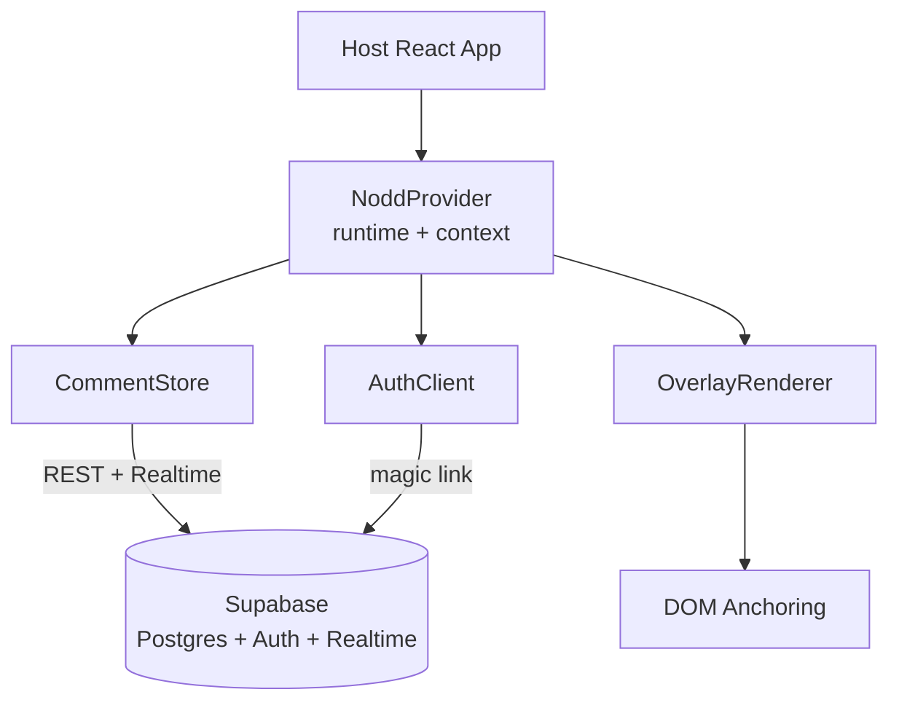
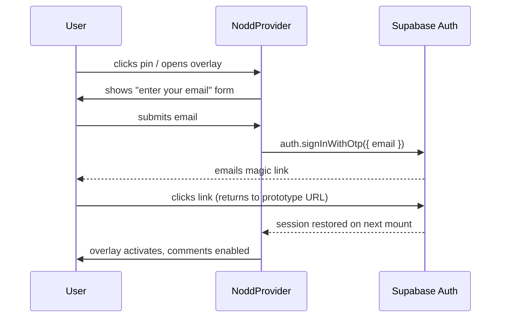

# Nodd — Architecture Design

> System-wide architecture, module decomposition, and key design decisions for Nodd — a drop-in React library that adds Figma-like spatial comments to live React prototypes.

Related: [Goal & Requirements](GOAL&REQUIREMENTS.md)

## 1. High-Level Architecture

Nodd is a **client-side React library** + a **Supabase-hosted backend**. There is no custom server. The library is distributed via npm; consumers wrap their app in `<NoddProvider>`, which boots a runtime that renders an overlay on top of the host app and synchronises comments through the Supabase JS client.



### Layers
1. **Integration layer** — `NoddProvider` is the only public component the host app sees. Everything else is internal.
2. **Runtime layer** — Owns app state (current user, project id, page id, overlay visibility), coordinates modules, and renders the overlay via a React portal.
3. **Domain layer** — `CommentStore` (data + sync), `AuthClient` (session), `OverlayRenderer` (UI), `DOMAnchor` (positioning).
4. **Backend layer** — Supabase: Postgres tables + Row-Level Security + Realtime channels + Auth (magic link).

### Architectural Style
**Layered library with BaaS backend.** Chosen over alternatives because:
- A *pipeline* doesn't fit — comments are queried, not transformed through stages.
- *Microservices* are overkill for a 5-minute-setup library.
- *Event-driven* is partially used (Realtime subscriptions feed the store) but is not the dominant pattern.

## 2. Module Decomposition

Five modules, each owning one concern. Consumer-facing surface is intentionally tiny: one component, one hook.

| Module | Path | Responsibility |
|--------|------|----------------|
| `NoddProvider` | `src/provider/` | Public entry point. Boots runtime, wires context, mounts portal, exposes `useNodd()`. |
| `OverlayRenderer` | `src/overlay/` | Renders pin markers, hover highlight, click-to-pin capture layer, sidebar/panel, comment thread popovers. |
| `CommentStore` | `src/store/` | In-memory + IndexedDB cache, optimistic CRUD, Realtime subscription, page-scoped fetching. |
| `AuthClient` | `src/auth/` | Magic-link sign-in, session restore, sign-out, current-user observable. |
| `SupabaseSchema` | `supabase/` | SQL migrations, table definitions, RLS policies, indexes. Not bundled in the npm package. |

### Public API surface
```ts
// Component
<NoddProvider projectId="..." supabaseUrl="..." supabaseAnonKey="..."> {children} </NoddProvider>

// Hook (advanced — for custom toggles, programmatic open, etc.)
const { user, signIn, signOut, toggleOverlay, isVisible } = useNodd();
```

That's it. Everything else is internal.

### Dependency direction
`NoddProvider` → `{AuthClient, CommentStore, OverlayRenderer}` → `DOMAnchor` (utility) → Supabase JS client.
No module imports `NoddProvider`. No circular dependencies.

## 3. Data Model

All tables live in the host project's Supabase instance. Schema is shipped as SQL migrations under `supabase/migrations/`.

### Tables

```sql
-- Project: an instance of Nodd (one per prototype/site)
create table projects (
  id uuid primary key default gen_random_uuid(),
  name text not null,
  created_at timestamptz default now()
);

-- Membership: users invited to a project
create table project_members (
  project_id uuid references projects(id) on delete cascade,
  user_id uuid references auth.users(id) on delete cascade,
  role text default 'member',          -- member | admin
  primary key (project_id, user_id)
);

-- Thread: a top-level comment + its replies share a thread_id
create table threads (
  id uuid primary key default gen_random_uuid(),
  project_id uuid references projects(id) on delete cascade,
  url_path text not null,              -- e.g. '/checkout/step-2'
  pin jsonb not null,                  -- DOM anchor (see §5)
  resolved boolean default false,
  resolved_by uuid references auth.users(id),
  resolved_at timestamptz,
  created_by uuid references auth.users(id),
  created_at timestamptz default now()
);
create index threads_project_path_idx on threads(project_id, url_path) where resolved = false;

-- Comment: a single message in a thread
create table comments (
  id uuid primary key default gen_random_uuid(),
  thread_id uuid references threads(id) on delete cascade,
  author_id uuid references auth.users(id),
  body text not null,
  mentions uuid[] default '{}',        -- referenced user ids
  created_at timestamptz default now(),
  edited_at timestamptz
);
create index comments_thread_idx on comments(thread_id, created_at);
```

Users come from `auth.users` (managed by Supabase). A `profiles` view exposes `id, email, display_name, avatar_url`.

### Pin (DOM anchor) JSON
Stored in `threads.pin` as a single jsonb blob:
```ts
type Pin = {
  selector: string;        // "main > section:nth-of-type(2) > div.card[data-id='hero']"
  offsetX: number;         // 0..1, relative to element bounding box width
  offsetY: number;         // 0..1, relative to element bounding box height
  fingerprint: string;     // hash of textContent + tag + classList for fuzzy re-find
  viewportWidth: number;   // captured at creation, for responsive fallback
};
```

### RLS Policies (sketch)
- `select` on threads/comments: user must be member of `threads.project_id`.
- `insert` on threads/comments: same; `author_id` must equal `auth.uid()`.
- `update` on `threads.resolved`: any member; on `comments.body`: only `author_id`.

## 4. Auth Flow (Supabase Magic Link)



- Library uses `@supabase/supabase-js` `signInWithOtp` with `emailRedirectTo: window.location.href`.
- Session persisted to `localStorage` by Supabase client; restored on `NoddProvider` mount.
- Unauthenticated users see read-only pins (or nothing, depending on `projects.public_read`); cannot create or reply.
- Invite-link flow (out of v1) is a stretch goal: a project admin generates a tokenised URL that auto-creates a `project_members` row on first sign-in.

## 5. DOM Anchoring Strategy

Pins must survive page reloads and minor layout/markup changes. We use a **three-tier fallback**:

### Tier 1 — Selector path (primary)
At pin creation, walk from the clicked element up to `<body>` and build a CSS selector:
- Prefer stable attributes: `[data-nodd-id]`, `[data-testid]`, `[id]`, `[role]`.
- Fall back to `tag.className:nth-of-type(n)`.
- Cap depth at 8 ancestors to avoid brittleness.

### Tier 2 — Element fingerprint (verification + fuzzy match)
A `fingerprint` is `sha1(tagName + sortedClassList + truncatedTextContent)`. On reload:
1. Run the selector. If exactly one element matches and its fingerprint matches → resolved.
2. If selector matches multiple, pick the one whose fingerprint matches.
3. If selector matches none, run a `querySelectorAll` over candidate tags (same as anchor's tag) and find the closest fingerprint match within a Levenshtein threshold.

### Tier 3 — Orphaned pin
If no candidate is found, the pin is shown in the sidebar as **"Orphaned — original target not found"** with a snippet of the captured text. It is not rendered on the page until the element returns.

### Position within the element
`offsetX` / `offsetY` are normalised 0..1 relative to the element's bounding box at click time. On render, position = `bbox.topLeft + (offsetX * bbox.width, offsetY * bbox.height)`. This is robust to the element being resized but not to its content being completely restructured.

### Re-anchoring on resize
A single `ResizeObserver` watches `document.body` and re-runs position calculations (not selector resolution) on the next animation frame. Selector resolution is only re-run on route change.

## 6. Overlay Z-Index & Pointer-Events Strategy

The non-functional requirement "**zero layout shift**" is critical. Our approach:

1. **Single React portal** mounted to a `<div id="nodd-root">` appended to `document.body` on `NoddProvider` mount.
2. The root is `position: fixed; inset: 0; z-index: 2147483000; pointer-events: none;` — it overlays the entire viewport without affecting host layout.
3. **Pin markers** set `pointer-events: auto` only on themselves, so the rest of the page remains clickable.
4. **Capture mode** (when the user clicks "Add comment"): the root flips to `pointer-events: auto` to intercept the next click; on click, we use `document.elementFromPoint(x, y)` *after* temporarily hiding the overlay (`visibility: hidden` for one frame) so we hit-test the host DOM, then re-show.
5. **Toggle off**: the entire portal is unmounted (`return null` from overlay), guaranteeing zero CSS or DOM presence.
6. All Nodd styles are scoped under `[data-nodd-root]` and use CSS custom properties to avoid bleeding into the host. We ship a single CSS file with no global selectors.

## 7. Build & Distribution

### Tooling: **tsup**
Chosen over Vite library mode for simplicity — zero config, fast esbuild-based, dual ESM/CJS output, type declarations via `--dts`.

```jsonc
// tsup.config.ts (sketch)
{
  entry: ['src/index.ts'],
  format: ['esm', 'cjs'],
  dts: true,
  sourcemap: true,
  external: ['react', 'react-dom', '@supabase/supabase-js'],
  treeshake: true,
  minify: false   // let consumers decide
}
```

### npm package shape
```
nodd/
├── dist/
│   ├── index.js        (CJS)
│   ├── index.mjs       (ESM)
│   ├── index.d.ts
│   └── style.css
├── package.json
└── README.md
```

### `package.json` essentials
```jsonc
{
  "name": "nodd",
  "main": "dist/index.js",
  "module": "dist/index.mjs",
  "types": "dist/index.d.ts",
  "exports": {
    ".": { "import": "./dist/index.mjs", "require": "./dist/index.js", "types": "./dist/index.d.ts" },
    "./style.css": "./dist/style.css"
  },
  "sideEffects": ["**/*.css"],
  "peerDependencies": {
    "react": ">=18",
    "react-dom": ">=18"
  },
  "dependencies": {
    "@supabase/supabase-js": "^2"
  }
}
```

Consumer integration is two lines:
```tsx
import { NoddProvider } from 'nodd';
import 'nodd/style.css';
```

## 8. Sub-200ms Comment Load Strategy

The non-functional requirement "comments for a page must load within 200ms" drives several decisions:

1. **Page-scoped query.** On mount/route change, `CommentStore` issues a single query:
   `select * from threads where project_id = $1 and url_path = $2 and resolved = false` with a side-load of comments via PostgREST embed. The composite index `(project_id, url_path) where resolved = false` keeps this O(matching rows).
2. **Optimistic local cache (IndexedDB).** Threads + comments are persisted client-side keyed by `(projectId, urlPath)`. On mount, the cached snapshot renders instantly (often <20ms), then the network response reconciles. Stale data is acceptable because the Realtime subscription will catch up within seconds.
3. **Realtime subscription, not polling.** A Supabase channel `threads:project_id=eq.{id}` filters server-side; we then locally filter by `url_path`. Updates are delta-applied to the store.
4. **Lazy hydration of resolved threads.** The default query excludes resolved threads. The sidebar's "Resolved" tab fetches them on demand.
5. **Mention/profile data prefetched once.** `project_members` joined with `profiles` is fetched once per session and cached, so comment rendering never blocks on user lookups.
6. **No avatar network roundtrip on first paint.** Avatars use `loading="lazy"` and a colour-from-name fallback so the pin numbers render before any image loads.

### Budget
| Stage | Target |
|------|--------|
| IndexedDB cache hit + render | < 30 ms |
| Network query (cold) | < 120 ms (Supabase median + index) |
| Pin layout pass | < 20 ms |
| **Total cold** | **< 200 ms** |

## 9. Design Principles

- **Separation of concerns** — Each module has one job; data, UI, anchoring, and auth never mix.
- **Explicit over implicit** — Public API is one component + one hook. No global side-effects, no monkey-patching.
- **Zero host impact** — When the overlay is off, Nodd is unmounted. No layout shift, no DOM mutation, no CSS leakage.
- **Fast first paint** — Optimistic cache + page-scoped queries prioritise perceived speed over consistency on first load.

## 10. Module Documentation Index

The following module-level design docs will be created next (one per module):

- `src/provider/README.md` — NoddProvider runtime
- `src/overlay/README.md` — OverlayRenderer
- `src/store/README.md` — CommentStore
- `src/auth/README.md` — AuthClient
- `supabase/README.md` — Supabase schema, migrations, RLS

## 11. Open Questions / Future Work

- **Public read access** for unauthenticated viewers — define `projects.public_read` flag and corresponding RLS.
- **State-aware comments** — threads carry a `state_key` (slash-joined breadcrumb) recording the host-app state in which they were pinned. Hosts opt into stateful regions with `<NoddState name="…">`, which renders a `display: contents` wrapper carrying `data-nodd-state`. Capture and pin gating both walk the DOM ancestry of the click target / anchor element to compute the state stack — there is no single "current state", state is a property of *where* you clicked. The Sidebar surfaces threads pinned to states the reviewer is not currently in via an "Other states · N" pill. Auto-detection of `[role="dialog"]`, hash-based routes, and a `restoreState(stack)` callback are deferred to v2.
- **Real-time presence** (out of v1) — would use Supabase Realtime presence channels.
- **Self-hosted backend** (out of v1) — abstract the Supabase client behind a `Backend` interface to enable swappable implementations later.
