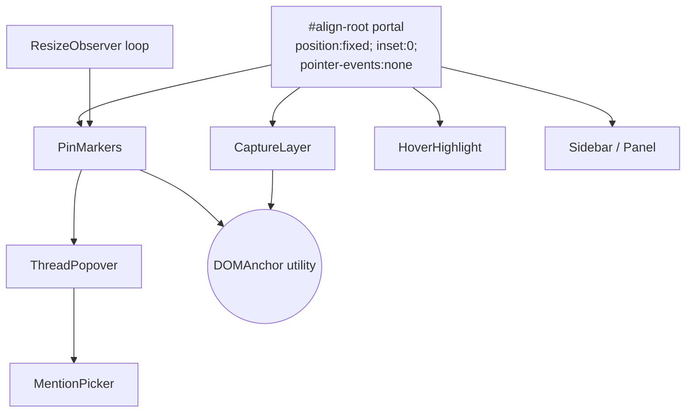

# OverlayRenderer

> Renders the entire Align UI on top of the host React app: pin markers, hover highlight, click-to-pin capture layer, sidebar panel, comment thread popovers, and the @mention picker. Owns DOM anchoring of pins to host elements and re-positioning on layout changes.

Related: [Align — Architecture Design](../../DESIGN_DOC.md) · [Align — Goal & Requirements](../../GOAL%26REQUIREMENTS.md)

## 1. Purpose

`OverlayRenderer` is the visual layer of Align. It is mounted by `AlignProvider` into a single React portal and is responsible for every pixel Align draws on screen. It must satisfy two non-functional requirements from the architecture:

1. **Zero layout shift on the host app.** When the overlay is hidden, no Align DOM, styles, or event listeners may affect host layout or interactivity.
2. **Sub-200ms perceived response.** Pin layout passes (post-fetch from `CommentStore`) must complete in under 20 ms; hover highlight must track the cursor at 60 fps.

The module is intentionally side-effect free with respect to the host: it renders into a portal, scopes all CSS under `[data-align-root]`, and uses `pointer-events` gating to remain transparent to the host's interactivity.

## 2. Internal Structure

**Pattern:** Composition of independent presentational components, coordinated by a thin local state machine for *capture mode* and a single `ResizeObserver` for re-anchoring. The data source (`CommentStore`) and identity (`AuthClient`) are injected via context — `OverlayRenderer` never fetches.



A diagram of this structure is rendered in the chat (visId `module-arch-overlay`).

## 3. Public Interface

`OverlayRenderer` is **not** a public-API module. It is internal to the `@align/react` package and only consumed by `AlignProvider`. Its surface to the rest of the library:

| Export | Kind | Description |
|--------|------|-------------|
| `<OverlayRenderer />` | React component | Renders the portal contents. Reads `useAlignContext()` for store/auth/visibility/route. Returns `null` when overlay is toggled off. |
| `useCaptureMode()` | Hook (internal) | Exposes `{ isCapturing, beginCapture, cancelCapture }` so toolbar/sidebar UI elsewhere can trigger capture. |
| `OverlayMessages` | Type | Discriminated union of internal events (`pin.created`, `pin.dismissed`, `thread.opened`). Emitted to `CommentStore` via injected callbacks; never exported from the package. |

`OverlayRenderer` is mounted by `AlignProvider` like:

```tsx
{isVisible && createPortal(<OverlayRenderer />, alignRootEl)}
```

## 4. Output Contract

`OverlayRenderer` does not return data — its contract is **DOM and behaviour**:

| Output | Guarantee |
|--------|-----------|
| Portal root `<div data-align-root>` | Mounted at `document.body`; `position:fixed; inset:0; z-index:2147483000; pointer-events:none`. Removed entirely when overlay is hidden. |
| Pin markers | One per resolved (non-orphan) thread on the current `url_path`; positioned at `bbox.topLeft + (offsetX·w, offsetY·h)`; `pointer-events:auto` only on the marker element. |
| Hover highlight | A single absolutely-positioned rectangle outlining the anchored element of the currently-hovered pin; `pointer-events:none`. |
| Capture click | When `isCapturing`, the next click on the host page is intercepted, mapped to a host element via the `elementFromPoint` trick (§7), converted to a `Pin` via `DOMAnchor.create`, and emitted as `pin.created`. The original click is **not** forwarded to the host. |
| Side effects on host | None. No global event listeners outside the portal root. No mutation of host DOM, styles, or attributes. |

## 5. Internal File Organization

```
src/overlay/
├── README.md                  ← this document
├── index.ts                   ← exports OverlayRenderer, useCaptureMode
├── OverlayRenderer.tsx        ← top-level portal component, orchestrator
├── components/
│   ├── CaptureLayer.tsx       ← full-viewport click interceptor (capture mode)
│   ├── PinMarker.tsx          ← single numbered pin; click → opens ThreadPopover
│   ├── HoverHighlight.tsx     ← element outline rect, follows hovered pin
│   ├── Sidebar.tsx            ← slide-out list of all threads on current page
│   ├── ThreadPopover.tsx      ← anchored popover with comments + reply input
│   └── MentionPicker.tsx      ← @-trigger autocomplete over project members
├── anchoring/
│   ├── DOMAnchor.ts           ← create / resolve pins (3-tier strategy)
│   ├── selectorBuilder.ts     ← walk-up CSS selector with stable-attr preference
│   ├── fingerprint.ts         ← sha1(tag + classList + truncatedText)
│   ├── resolver.ts            ← tier-1/2/3 matching
│   └── reanchorLoop.ts        ← ResizeObserver-driven rAF position recalculation
├── styles/
│   └── overlay.css            ← all rules scoped under [data-align-root]
└── __tests__/                 ← jsdom + Playwright snapshots
```

## 6. Layout & Z-Index

The portal root is the only element Align ever appends to `document.body`:

```css
[data-align-root] {
  position: fixed;
  inset: 0;
  z-index: 2147483000;        /* one below max int to leave room for tooltips */
  pointer-events: none;        /* transparent to host */
  /* CSS custom properties for theming */
  --align-accent: #4f46e5;
  --align-pin-size: 28px;
  --align-bg: rgba(17, 17, 17, 0.92);
  --align-fg: #fff;
}

[data-align-root] .align-pin,
[data-align-root] .align-popover,
[data-align-root] .align-sidebar,
[data-align-root] .align-capture-active {
  pointer-events: auto;        /* re-enable only where we need clicks */
}
```

All overlay CSS rules live under `[data-align-root]` to prevent any leakage. Host page styles cannot affect Align because Align uses fixed positioning and explicit values for every property that could inherit.

## 7. Capture-Mode Click Flow

When the user clicks "Add comment" in the toolbar, the overlay enters *capture mode*. Implementing click-to-pin is non-trivial because the overlay sits on top of the host DOM — naïvely, `elementFromPoint` would always return the overlay itself.

Algorithm (in `CaptureLayer.tsx`):

```
1. Set pointer-events:auto on the portal root and show a crosshair cursor.
2. Listen for the next `click` event on document.
3. On click:
   a. Record (clientX, clientY).
   b. Set `visibility: hidden` on the portal root.
   c. await one animation frame (requestAnimationFrame).
   d. const target = document.elementFromPoint(x, y);
   e. Restore `visibility: visible`.
   f. If target is null or === document.body:
        emit pin.dismissed and exit capture mode.
      else:
        const pin = DOMAnchor.create(target, x, y);
        emit pin.created(pin).
4. preventDefault() + stopPropagation() so the host never receives the click.
```

`visibility:hidden` (rather than `display:none`) is used because it preserves layout — the overlay does not flicker in/out and there is no reflow cost. One frame is sufficient; the browser's hit-testing uses the most recent paint.

The `await rAF` step is wrapped in a try/finally so visibility is always restored even if `DOMAnchor.create` throws.

## 8. Pin Marker Positioning Math

For each non-orphan thread on the current `url_path`, the renderer:

1. Calls `DOMAnchor.resolve(thread.pin)` → returns the live `Element` or `null`.
2. If non-null: reads `el.getBoundingClientRect()` → `{ top, left, width, height }`.
3. Computes pin center:
   ```
   px = left + offsetX * width
   py = top  + offsetY * height
   ```
4. Renders `<PinMarker>` at `transform: translate(px - r, py - r)` where `r = pinSize / 2`. `transform` is used (not `top`/`left`) so animation/repositioning runs on the compositor thread.
5. The pin's number is its 1-based index in the chronologically-sorted thread list for the page (matches sidebar order).

If the bounding rect is fully outside the viewport, the marker is rendered with reduced opacity at the nearest viewport edge so users can still navigate to it (clicking scrolls the anchor element into view).

## 9. Hover Highlight

When the user hovers a pin (or hovers a sidebar list item), the overlay outlines the anchored element:

- Single `<HoverHighlight>` instance reused across all pins (one DOM node).
- On hover: read `getBoundingClientRect()` of the resolved element; set the highlight's `transform: translate(left, top)` and `width`/`height`.
- Style: `outline: 2px solid var(--align-accent); border-radius: 4px;` plus a subtle box-shadow halo.
- `pointer-events: none` so it never intercepts clicks.
- Hidden via `display:none` when no pin is hovered.

Updates use `requestAnimationFrame` to coalesce hover-move events to 60 fps.

## 10. Sidebar / Panel Layout

The sidebar is a slide-out drawer rendered into the same portal:

- Width: `min(360px, 90vw)`. Anchored to the right edge: `right:0; top:0; bottom:0`.
- Tabs: **Open** (default) and **Resolved**. Resolved threads are lazy-loaded from `CommentStore.fetchResolved(urlPath)`.
- Each list item shows pin number, author avatar+name, first comment snippet, timestamp, reply count.
- Click on item → scrolls anchored element into view, opens the thread popover, and emphasises the pin.
- Hover on item → triggers the same `HoverHighlight` as hovering the pin itself.
- The drawer slides in via `transform: translateX(100%) → 0` over 180ms; respects `prefers-reduced-motion`.

## 11. Comment Thread Popover

`<ThreadPopover>` is opened on pin click or sidebar item click. It is positioned next to the pin using a Floating-UI-style placement strategy:

- Preferred placement: `right-start`. Falls back to `left-start`, `bottom-start`, `top-start` if it would overflow the viewport.
- Width: 320px; max-height: `min(60vh, 480px)` with internal scroll for long threads.
- Contents: comment list (avatar, name, bodywith mention chips, timestamp, edit/delete menu for own comments), Resolve toggle (project members only), reply textarea with `MentionPicker` integration.
- Dismissed on: outside click (excluding the source pin), Esc, or after `Resolve`.
- Optimistic submit: replies appear immediately with a "sending..." state; reconciled when `CommentStore` confirms.

Only one popover may be open at a time; opening a new one closes the previous.

## 12. @Mention Picker

`<MentionPicker>` is a positioned listbox triggered from the reply textarea:

- Trigger: typing `@` at a word boundary.
- Source: `CommentStore.getProjectMembers()` (cached for the session — see DESIGN_DOC §8.5).
- Filtering: substring match on `display_name` and `email`, ranked by recent collaboration on the same project.
- Keyboard: ↑/↓ to navigate, Enter/Tab to select, Esc to close.
- On select: replaces `@partial` in textarea with `@displayName` (visual chip) and pushes the user's `id` to the comment's `mentions[]` array (per schema in DESIGN_DOC §3).
- Positioned above or below the caret using a textarea-mirror DOM (or `getClientRects()` of a `Range` if a contenteditable is used).

## 13. DOMAnchor Utility

Implements the three-tier anchoring strategy from [DESIGN_DOC §5](../../DESIGN_DOC.md#5-dom-anchoring-strategy). API:

```ts
export type Pin = {
  selector: string;
  offsetX: number;       // 0..1
  offsetY: number;       // 0..1
  fingerprint: string;
  viewportWidth: number;
};

export const DOMAnchor: {
  /** Build a Pin from a clicked element + page coordinates. */
  create(target: Element, clientX: number, clientY: number): Pin;

  /** Resolve a Pin to a live element via the 3-tier strategy. */
  resolve(pin: Pin): { element: Element; tier: 1 | 2 | 3 } | null;

  /** Cheap re-position only (no selector re-run); used by ResizeObserver loop. */
  reposition(pin: Pin, cachedElement: Element): { x: number; y: number };
};
```

### 13.1 `selectorBuilder.ts` — walk-up CSS path

Walks from `target` up to `<body>`, capped at 8 ancestors. For each level, picks the first available stable identifier in this priority:

1. `[data-align-id="…"]`
2. `[data-testid="…"]`
3. `#id` (only if the id is unique in the document)
4. `[role="…"]`
5. `tag.class1.class2:nth-of-type(n)` — class list filtered to those that don't look auto-generated (heuristic: drop tokens matching `^[a-z0-9_-]{6,}$` with no vowels — they're likely hashes from CSS-in-JS).

Stops walking up as soon as the partial selector is unique under `document` (`querySelectorAll(...).length === 1`). The selector is built right-to-left and joined with `>` for explicit child relationships when needed for uniqueness.

### 13.2 `fingerprint.ts`

```ts
sha1(
  el.tagName +
  '|' +
  [...el.classList].sort().join('.') +
  '|' +
  (el.textContent ?? '').trim().slice(0, 64)
)
```

Truncating textContent to 64 chars keeps fingerprints stable across minor copy edits while still being discriminating. Hash is hex-encoded (40 chars).

### 13.3 `resolver.ts` — 3-tier resolution

```
Tier 1 — Selector path:
  matches = document.querySelectorAll(pin.selector)
  if matches.length === 1 and fingerprint(matches[0]) === pin.fingerprint:
    return { element: matches[0], tier: 1 }
  if matches.length > 1:
    pick the one whose fingerprint matches; if exactly one, return tier:1.

Tier 2 — Fuzzy fingerprint match:
  Extract tagName from pin.selector (last segment).
  candidates = document.querySelectorAll(tagName)
  best = candidate with min Levenshtein(fingerprint, pin.fingerprint)
  if Levenshtein <= THRESHOLD (default 6):
    return { element: best, tier: 2 }

Tier 3 — Orphaned:
  return null
```

Tier-3 results cause the pin to be excluded from page rendering and listed in the sidebar's "Orphaned" group with the captured text snippet (DESIGN_DOC §5).

### 13.4 Position normalisation

At creation time, given click `(cx, cy)` and resolved `target`:

```ts
const r = target.getBoundingClientRect();
offsetX = clamp((cx - r.left) / r.width,  0, 1);
offsetY = clamp((cy - r.top)  / r.height, 0, 1);
```

`viewportWidth = window.innerWidth` is captured for future responsive fallback (not used in v1 rendering, but required by schema).

## 14. ResizeObserver Re-anchoring Loop

`reanchorLoop.ts` maintains pin positions when the host layout changes (CSS animations, content load, viewport resize, font load):

```ts
const ro = new ResizeObserver(() => scheduleRecalc());
ro.observe(document.body);

let pending = false;
function scheduleRecalc() {
  if (pending) return;
  pending = true;
  requestAnimationFrame(() => {
    pending = false;
    for (const pin of activePins) {
      const el = anchorCache.get(pin.id);   // resolved at mount or route change
      if (!el || !el.isConnected) continue; // will be re-resolved on route change
      const { x, y } = DOMAnchor.reposition(pin, el);
      pinElement(pin.id).style.transform = `translate(${x}px, ${y}px)`;
    }
    HoverHighlight.refresh();                // also moves with anchor
  });
}
```

Key properties:
- **Single observer** on `document.body` (not per-element) — cheap and catches all layout changes.
- **rAF coalescing** — multiple resize ticks within a frame collapse into one position pass.
- **No selector resolution** in this loop. Selector resolution is expensive and only re-run on route change (`url_path` change observed via `useAlignRoute`).
- **`isConnected` guard** — if the cached element was detached (e.g. virtualized list scrolled it out), the pin is hidden until route change re-resolves.
- Observer is torn down with the overlay; no leaks when toggled off.

## 15. CSS Scoping

All styles in `styles/overlay.css` are nested under `[data-align-root]`. Rules:

- No global selectors (no bare `body`, `*`, etc.).
- No CSS resets that could inherit; every property is set explicitly on Align elements.
- Theming via CSS custom properties on the root, so consumers may override accent color / font.
- `font-family` is set to `system-ui, -apple-system, "Segoe UI", sans-serif` to match host conventions without depending on host's font stack.
- Animations respect `@media (prefers-reduced-motion: reduce)`.

The CSS file ships as `dist/style.css` (per DESIGN_DOC §7) and consumers import it once.

## 16. Design Decisions

| Decision | Rationale |
|----------|-----------|
| **Single React portal, not shadow DOM** | Shadow DOM would isolate styles perfectly but breaks `position:fixed` relative to viewport in some browsers, and prevents `elementFromPoint` from seeing host nodes from inside. A scoped CSS prefix achieves 95 % of the isolation with none of the complexity. |
| **`visibility:hidden` for capture hit-test** | Preserves layout so there is no reflow cost; one frame is enough for the next paint to omit the overlay from hit-testing. `display:none` would trigger relayout on every capture click. |
| **`transform: translate(...)` for pin positioning** | Compositor-thread updates run at 60 fps even with hundreds of pins, vs `top`/`left` which trigger layout. Crucial for the ResizeObserver loop. |
| **Single `ResizeObserver` on `body`** | One observer is dramatically cheaper than per-element observers, and we don't need to know *which* element resized — we just re-position all visible pins. |
| **Selector resolution only on route change** | DOM queries dominate cost; layout changes happen far more often than routes. Caching resolved elements between route changes keeps the rAF loop trivial. |
| **3-tier anchoring** | Selector is fast and usually correct; fingerprint catches markup churn; orphan tier prevents silently dropping user data. |
| **Class-token heuristic in selector builder** | CSS-in-JS produces hashed class names like `_a3kf91x` that change on every build. Filtering them out makes selectors stable across rebuilds without giving up on class-based specificity entirely. |
| **No `pointer-events: auto` on the portal root** | Default is transparent to host clicks. Flipped to `auto` only during capture mode and on individual interactive sub-elements. Guarantees the "zero host impact when off" requirement — even a momentary mis-toggle cannot accidentally swallow host clicks. |

## 17. Known Limitations

- **Heavy virtualization (e.g. react-window)**: anchored elements may be unmounted as the user scrolls; pins disappear until the element re-mounts and the route handler re-resolves. Acceptable for v1; a future enhancement could observe the virtual list container.
- **Full markup restructuring**: if a designer rewrites a section's tag structure entirely, the fingerprint will diverge beyond the Levenshtein threshold and the pin will be orphaned. By design — orphans are surfaced in the sidebar rather than guessed.
- **Iframes**: pins cannot be placed on elements inside cross-origin iframes (`elementFromPoint` returns the `<iframe>` itself). Same-origin iframes are out of scope for v1.
- **Shadow DOM in host**: elements inside a host-app shadow tree are not addressable by the selector builder (querySelectorAll doesn't pierce shadow roots). v1 will emit a warning and refuse to create the pin.
- **Coordinate precision under CSS transforms**: if an ancestor has a non-identity `transform` (rotate/scale), the bounding-rect math still works, but normalised offsets may visually drift if the transform animates. Acceptable; pins are conceptually attached to the element, not absolute coordinates.
- **No keyboard-only pin creation in v1**: capture mode requires a click. Keyboard accessibility for placing pins is a v1.1 follow-up.

## 18. Sub-Modules

| Sub-module | Spec | Status |
|------------|------|--------|
| `anchoring/` | [DOM Anchoring](anchoring/README.md) | Specified — selector walk-up, fingerprint, 3-tier resolver, route-change/ResizeObserver split. The algorithmic core of this module. |
| `components/` | [Overlay Components](components/README.md) | Specified — component-level contract (props, state, interaction sequences) for `PinMarker`, `HoverHighlight`, `Sidebar`, and `ThreadPopover`, plus integration view of `MentionPicker` and `CaptureLayer`. Includes `ThreadPopover`'s Floating-UI-style placement fallback chain and `Sidebar`'s drawer animation + tab semantics. |
| `components/MentionPicker.tsx` | [MentionPicker](components/MentionPicker.README.md) | Specified — caret tracking (textarea mirror + Range), prefix/recency ranking, sentinel mention token. |
| `components/CaptureLayer.tsx` | [CaptureLayer](components/CaptureLayer.README.md) | Specified — `visibility:hidden` + rAF + `elementFromPoint` hit-test, capture-phase click interception, Esc/empty-area cancel, crosshair + faint-backdrop UX. |
| `reanchorLoop.ts` | _not yet specified_ | Covered inline in §14; promote to its own spec if behaviour grows. |

## 19. Links

- **Parent:** [Align — Architecture Design](../../DESIGN_DOC.md)
- **Sibling modules:** `src/provider/README.md`, `src/store/README.md`, `src/auth/README.md`, `supabase/README.md` (to be created)
- **References:** DESIGN_DOC §5 (DOM anchoring), §6 (z-index & pointer-events), §8 (sub-200ms strategy)
