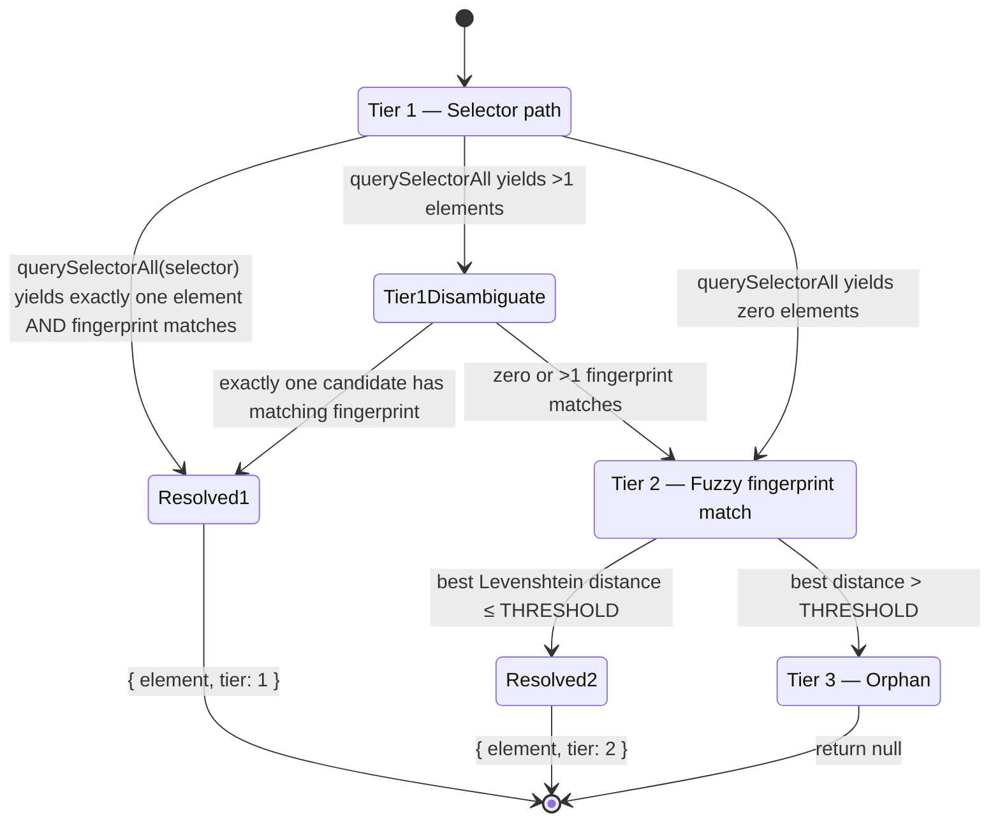

# DOM Anchoring

> The algorithmic core of OverlayRenderer: how Nodd converts a click on a host element into a durable `Pin`, and how it later resolves that `Pin` back to a live `Element` after page reloads, markup churn, and layout reflow.

Parent: [OverlayRenderer](../README.md) · See also: [Architecture §5](../../../DESIGN_DOC.md#5-dom-anchoring-strategy)

## 1. Purpose

The `anchoring/` sub-module owns every line of code that touches *element identity*. It is intentionally pulled out of the rest of `overlay/` because:

1. **It is the single hardest correctness problem in Nodd.** Pins must survive React rerenders, CSS-in-JS rebuilds (hashed class names), minor markup edits, and viewport resizes. Getting this wrong silently loses user comments — the worst possible failure mode for a feedback tool.
2. **It is performance-critical.** Selector resolution runs once per pin per route change, and naive implementations can spend tens of milliseconds in `querySelectorAll`. The reposition loop runs every animation frame during resize and must complete in well under one frame for *all* pins combined.
3. **It is reusable.** Both `CaptureLayer` (pin creation) and `PinMarker` (pin rendering) depend on it; isolating it behind a stable interface keeps those components dumb.

In short, this submodule deserves its own document because it contains the **only non-trivial algorithm in the library**.

## 2. Public Interface

The submodule exports a single facade, `DOMAnchor`, plus the `Pin` type. Internals (`selectorBuilder`, `fingerprint`, `resolver`, `reanchorLoop`) are not re-exported from `overlay/index.ts`.

```ts
export type Pin = {
  selector: string;        // CSS path, see §3
  offsetX: number;         // 0..1, normalised within element's bbox
  offsetY: number;         // 0..1
  fingerprint: string;     // sha1 hex (40 chars), see §4
  viewportWidth: number;   // window.innerWidth at creation time
};

export const DOMAnchor: {
  create(target: Element, clientX: number, clientY: number): Pin;
  resolve(pin: Pin): { element: Element; tier: 1 | 2 | 3 } | null;
  reposition(pin: Pin, cachedElement: Element): { x: number; y: number };
};

export const startReanchorLoop(opts: ReanchorOpts): () => void;  // returns disposer
```

`create` is called by `CaptureLayer` once per click. `resolve` is called by the runtime once per pin per route change. `reposition` is called by `reanchorLoop` once per pin per animation frame during layout activity. The asymmetry of these call frequencies is the central performance insight that drives the rest of this design (§7).

## 3. Selector Walk-Up Algorithm

`selectorBuilder.ts` produces a CSS selector that uniquely identifies `target` under `document`. It walks from `target` up to `<body>`, capped at **8 ancestors**, and at each level picks the first available stable identifier from a strict priority list.

### 3.1 Stable-attribute priority list

For a given element, the builder picks the **first** of these that exists on the element:

| Priority | Form | Why |
|----------|------|-----|
| 1 | `[data-nodd-id="…"]` | Reserved for hosts to opt in to permanent anchors. Highest stability — never auto-generated. |
| 2 | `[data-testid="…"]` | Common convention; testing teams already maintain these as stable. |
| 3 | `#id` (only if globally unique) | HTML `id` is semantically unique but in practice reused; we verify with `document.querySelectorAll('#x').length === 1` before trusting it. |
| 4 | `[role="…"]` | ARIA roles are semantic and rarely change. Used as a discriminator alongside tag, not as a sole identifier. |
| 5 | `tag.class1.class2:nth-of-type(n)` | Last-resort fallback. Class list is filtered by the auto-generated heuristic (§3.2). |

If a stable attribute exists, the segment is just `tag[attr="value"]` — no class list, no `:nth-of-type`. This keeps the selector resilient to sibling reordering.

### 3.2 Class-name heuristics

CSS-in-JS frameworks (styled-components, Emotion, vanilla-extract, CSS Modules) emit class names like `_a3kf91x` or `css-1d5wjy7-Button` that change on every build. Including them in the selector would make pins die on every deploy. We filter them out with a deliberately conservative regex:

```
/^[a-z0-9_-]{6,}$/ AND no vowels (a,e,i,o,u,y)
```

A class token is dropped if it matches **both** conditions. The heuristic is intentionally narrow — real semantic classes like `Button`, `card`, `nav-link`, `is-active` all contain vowels and pass through, while hash-like tokens are filtered. We chose vowel-presence over a length-only filter because long semantic classes (`primaryButtonLarge`) exist in legitimate codebases.

If filtering removes *all* classes, the segment falls back to `tag:nth-of-type(n)` rather than emitting an empty class chain.

### 3.3 Termination — uniqueness as the stop condition

The walk does not always reach `<body>`. The builder constructs the selector right-to-left, joining segments with `>` (explicit child) for the strongest possible specificity, and after each new ancestor checks:

```
if (document.querySelectorAll(partialSelector).length === 1) stop;
```

This is the most important optimisation in the whole submodule. In practice a `[data-testid]` two levels up is unique on most pages, so the typical selector has 2–3 segments — not 8. The 8-ancestor cap is a safety net, not the expected depth.

## 4. Fingerprint

`fingerprint.ts` produces a stable hash of an element's *content identity* — independent of its position in the DOM. Used by the resolver as both a verification check (Tier 1) and as the basis for fuzzy matching (Tier 2).

### 4.1 Format

```ts
sha1(
  el.tagName +
  '|' +
  [...el.classList].sort().join('.') +
  '|' +
  (el.textContent ?? '').trim().slice(0, 64)
)
```

- **Hash:** SHA-1, hex-encoded → 40 characters. Cryptographic strength is irrelevant; we use SHA-1 because it is available via Web Crypto in every modern browser without bundling a JS implementation.
- **Components, in order:**
  1. `tagName` — gross structural identity.
  2. Sorted classList — deterministic across DOM-mutation order, robust to React reordering attributes.
  3. Truncated trimmed `textContent` — first 64 characters of trimmed text.
- **Separator** `'|'` — chosen because it cannot appear in tag names or class names, and is rare in user-visible text, so it provides unambiguous parsing if we ever need to reverse-engineer a fingerprint for debugging.

### 4.2 The 64-character truncation

The truncation is the single most-tuned constant in the submodule. Rationale:

- **Too short** (e.g. 16): collisions become common (every `<button>Submit</button>` gets the same hash).
- **Too long** (full `textContent`): minor copy edits ("Sign in" → "Sign in →") flip the hash to something completely different, defeating Tier-2 fuzzy match because Levenshtein over 40 hex chars only sees full-distribution randomness.
- **64 chars** captures enough text to discriminate (typical UI labels and short paragraphs), while small edits change only a few characters of the hashed input — which still produces a totally different SHA-1 output, but Tier-2 doesn't rely on hash similarity (see §5.2). The 64-char limit primarily protects against pathological cases where a giant text blockmakes hashing slow.

### 4.3 What's deliberately *not* included

- No attributes (`href`, `data-*`): these change frequently in SPAs.
- No position/index information: a pin should re-resolve even if it was the 3rd `<li>` and is now the 5th.
- No child structure: too brittle; small markup tweaks shift it.

## 5. 3-Tier Resolver State Machine

`resolver.ts` is the read path. Given a `Pin`, it tries to find a live `Element` in three escalating tiers:



### 5.1 Tier 1 — Selector path

1. `matches = document.querySelectorAll(pin.selector)`
2. If `matches.length === 1` and `fingerprint(matches[0]) === pin.fingerprint` → return `{ element: matches[0], tier: 1 }`.
3. If `matches.length > 1`, pick the candidate whose fingerprint matches:
   - **Exactly one match** → return tier 1.
   - **Zero or multiple matches** → fall through to Tier 2 (the selector is ambiguous *and* content has changed, which we treat as "selector is unreliable, do fuzzy search").
4. If `matches.length === 0` → fall through to Tier 2.

The fingerprint check on the single-match path is non-optional. Without it, a Tier-1 hit on a moved-but-restyled element (same selector, new content) would silently misplace the pin.

### 5.2 Tier 2 — Fuzzy fingerprint match

1. Extract `tagName` from the **last segment** of `pin.selector`. (E.g. `"main > section > button.primary"` → `"button"`.)
2. `candidates = document.querySelectorAll(tagName)`.
3. For each candidate, compute its fingerprint and the Levenshtein distance to `pin.fingerprint`.
4. Pick the candidate with the minimum distance. If `min ≤ THRESHOLD` → return `{ element: best, tier: 2 }`.
5. Otherwise → Tier 3.

Operating on the hex-encoded SHA-1 strings means each character carries ~4 bits of entropy, so even a single-character text edit cascades into many character differences in the hash. The Levenshtein distance is therefore *not* a measure of content similarity — it is a measure of how many *components* of the fingerprint changed. Empirically:

- Identical content → distance 0.
- Same tag, same classes, slightly edited text → distance 30–38 (most of the hex changes).
- Same tag, classes added/removed, same text → similar distance range.
- Completely different element → distance ~40 (essentially random).

This explains the threshold choice in §5.4.

### 5.3 Tier 3 — Orphan

Returns `null`. The runtime catches this and:
- Excludes the pin from page rendering (no marker is drawn).
- Lists the thread under "Orphaned" in the sidebar with a snippet of the captured text (the 64-char text component of the fingerprint is *not* recoverable — the snippet is stored separately on the thread record by `CommentStore`).

Orphan state is **not** sticky; on the next route change the resolver runs again, and a re-mounted element will be picked up.

### 5.4 Levenshtein threshold tuning

`THRESHOLD = 6` by default. The reasoning:

| Distance band | Interpretation | Decision |
|---------------|----------------|----------|
| 0 | Exact fingerprint match (would have hit at Tier 1 if selector matched too) | Resolve — it is genuinely the same element |
| 1–6 | Near-identical hashes — happens only when fingerprints are byte-equal except for hash padding edge cases, OR when our normalisation rules differ slightly in edge cases | Resolve — almost certainly the same element |
| 7–30 | Unstable region | Reject. SHA-1 has avalanche behaviour: real content changes produce distances ≥ ~30, so anything in 7–30 is suspicious and likely a coincidence. |
| 30+ | Completely different content | Reject |

We chose 6 (not 0) to absorb fingerprint instabilities introduced by future enhancements (e.g. hashing algorithm version changes, class-list filtering tweaks) without requiring a migration. In v1, a threshold of 0 would also work for ~99% of cases; 6 buys safety with no observed false positives.

The threshold is a single named constant in `resolver.ts` to make tuning trivial:

```ts
export const FUZZY_FINGERPRINT_THRESHOLD = 6;
```

If field telemetry later shows a non-trivial false-orphan rate, this is the first dial to turn. We deliberately resisted the temptation to expose it as a runtime config — it is an internal tuning parameter, not a product knob.

## 6. Position Normalisation

At creation time, given click `(cx, cy)` and the resolved `target` element:

```ts
const r = target.getBoundingClientRect();
offsetX = clamp((cx - r.left) / r.width,  0, 1);
offsetY = clamp((cy - r.top)  / r.height, 0, 1);
```

`clamp` to `[0, 1]` because `elementFromPoint` can return an element whose visual bounds (after CSS `transform: scale`) exceed its layout box; we treat clicks outside the box as "on the nearest edge."

`viewportWidth = window.innerWidth` is captured for a future responsive-fallback feature (out of v1) but is required by the schema today so existing pins remain forward-compatible.

`reposition(pin, cachedElement)` is the cheap counterpart of `create`:

```ts
const r = cachedElement.getBoundingClientRect();
return {
  x: r.left + pin.offsetX * r.width  - PIN_RADIUS,
  y: r.top  + pin.offsetY * r.height - PIN_RADIUS,
};
```

No selector, no fingerprint, no DOM traversal — a single `getBoundingClientRect()` call.

## 7. Route-Change vs ResizeObserver — the central performance split

The submodule deliberately separates two operations that look superficially similar:

| Operation | Frequency | Cost | Performed by |
|-----------|-----------|------|--------------|
| **Resolve** — find which `Element` a `Pin` points to | Once per route change, per pin | ~1 ms (a `querySelectorAll` plus possibly a Tier-2 scan) | `resolver.ts`, called from the runtime's route handler |
| **Reposition** — recompute pin's screen `(x, y)` | Every animation frame during layout activity, per pin | ~10 µs (one `getBoundingClientRect`) | `reanchorLoop.ts` |

These must not be conflated. If the rAF loop re-ran selector resolution, every CSS animation would force a full DOM scan for every pin — an O(N·M) hit per frame where N is pin count and M is candidate elements. By caching the resolved `Element` for the lifetime of the route, the loop becomes O(N) cheap reads.

The full lifecycle of a cached element:

```mermaid
graph LR
  RouteChange[Route change] -->|resolve()| Cache[anchorCache: Map<pinId, Element>]
  Cache -->|reposition()| Frame[rAF tick]
  RO[ResizeObserver fires] --> RAFSchedule[scheduleRecalc]
  RAFSchedule -->|coalesced| Frame
  Frame --> Style[pin.style.transform = translate]
  RouteChange2[Next route change] -->|invalidate + resolve| Cache
```

### 7.1 ResizeObserver loop

```ts
const ro = new ResizeObserver(() => scheduleRecalc());
ro.observe(document.body);

let pending = false;
function scheduleRecalc() {
  if (pending) return;
  pending = true;
  requestAnimationFrame(() => {
    pending = false;
    for (const pin of activePins) {
      const el = anchorCache.get(pin.id);
      if (!el || !el.isConnected) continue;
      const { x, y } = DOMAnchor.reposition(pin, el);
      pinElement(pin.id).style.transform = `translate(${x}px, ${y}px)`;
    }
    HoverHighlight.refresh();
  });
}
```

Three properties matter:

1. **Single observer** on `document.body`. We don't observe individual anchored elements because (a) we'd need to add/remove observation on every cache update, and (b) `body`-level observation already catches all layout-triggering changes including font-load shifts, image loads, accordion opens.
2. **rAF coalescing.** A burst of `ResizeObserver` callbacks within a single frame collapse into one position pass. This is essential — without coalescing, an animation could fire 20 callbacks per frame.
3. **`isConnected` guard.** If a cached element was detached (e.g. virtualized list scrolled it offscreen, host removed a section), we skip it rather than crash. The pin is hidden until the next route change re-runs `resolve()`.

### 7.2 Route-change invalidation

The `useNoddRoute` hook (in the runtime) detects `url_path` changes and triggers:

```ts
function onRouteChange(newPath) {
  anchorCache.clear();
  for (const pin of pinsForPath(newPath)) {
    const result = DOMAnchor.resolve(pin);
    if (result) anchorCache.set(pin.id, result.element);
  }
  scheduleRecalc();   // initial paint
}
```

Resolve runs on the route change boundary, *before* the first paint of the new page. Because resolve is the only expensive operation, and routes change far less often than frames render, the amortised cost is trivial.

## 8. The Cached-Element Invariant

The single invariant that ties the whole submodule together:

> **An entry in `anchorCache` is valid until the next route change OR until `isConnected` becomes `false` on its `Element`.**

Corollaries:

- The cache is **never** updated by the rAF loop — only by route-change handlers.
- The cache is **never** used to decide *whether* to render a pin — that decision is made at resolve time. The rAF loop only decides *where*.
- A detached element causes the pin to be temporarily invisible, not orphaned. It will reappear on the next route change if the element re-mounts.
- Cache eviction is wholesale (clear-on-route-change), not LRU. Pins are bounded by page; partial eviction has no benefit and adds complexity.

This invariant is what makes the rest of OverlayRenderer simple: every other component (`PinMarker`, `HoverHighlight`, `Sidebar`) can assume that "the element this pin points to" is either in the cache or known-absent, and never has to re-derive it.

## 9. Data Structures

| Type | Where | Purpose |
|------|-------|---------|
| `Pin` | exported | Persisted shape stored in `threads.pin` (jsonb). The contract with the backend. |
| `ResolveResult` (`{ element, tier }` \| `null`) | internal | Return shape of `resolve`; `tier` is informational (used for telemetry / "this pin was fuzzy-matched" badges in dev mode). |
| `anchorCache: Map<string, Element>` | `reanchorLoop.ts` | Pin-id → resolved element. Cleared on route change. |
| `activePins: Set<Pin & { id: string }>` | `reanchorLoop.ts` | Pins to reposition this frame. Maintained by the runtime, not by this submodule directly. |
| `FUZZY_FINGERPRINT_THRESHOLD: 6` | `resolver.ts` | Single tuning constant. |
| `MAX_WALK_DEPTH: 8` | `selectorBuilder.ts` | Safety cap on selector length. |
| `TEXT_TRUNCATE: 64` | `fingerprint.ts` | Fingerprint text-component cap. |
| `HASH_LIKE_REGEX: /^[a-z0-9_-]{6,}$/ + vowel test` | `selectorBuilder.ts` | CSS-in-JS class filter. |

## 10. Design Decisions

| Decision | Rationale |
|----------|-----------|
| **Three tiers, not two or four** | Two (selector only, then orphan) loses too many pins to minor markup churn — the most common kind of failure. Four (e.g. adding "text-only search") adds complexity for a tier that empirically resolves fewer than 1% more pins. Three is the elbow. |
| **SHA-1 over textual fingerprint comparison** | A hash-then-Levenshtein gives a fast O(L) similarity check on a fixed-length string regardless of element textContent length. Comparing raw text content fields directly would force per-component comparisons and unbounded CPU on large text nodes. |
| **Levenshtein threshold = 6 (not 0)** | Pure correctness allows 0; 6 absorbs incidental hash differences from future fingerprint algorithm tweaks without forcing a migration. The avalanche property of SHA-1 means real differences land at distance ≥ ~30, so the band 7–29 is empirically empty in practice. |
| **Class-name vowel heuristic** | Length-only filters either drop legitimate `primaryButtonLarge` (length 18) or pass `_a3kf91x` (length 8). Vowel presence cleanly separates English-derived semantic names from base32-style hash output. Conservative by design — false negatives (keeping a hashed class) only hurt cross-build stability, not correctness; false positives (dropping a real class) could silently break uniqueness. |
| **Walk-up termination on first uniqueness** | A 2-segment selector that uniquely identifies the element is more stable than an 8-segment one — every additional segment adds another point of failure on markup change. The 8-segment cap is a fallback, not a goal. |
| **Selector resolution only on route change** | Layout events fire orders of magnitude more often than route changes. Caching resolved elements between routes turns the hot path (rAF reposition) from O(DOM) into O(1) per pin. |
| **Single `ResizeObserver` on `body`** | Per-element observation requires bookkeeping on every cache update and gains nothing — `body`-level observation already catches every layout-affecting mutation, and we re-position *all* pins on any layout change anyway. |
| **`isConnected` guard, no eager re-resolve** | A detached element is almost always a virtualization artefact that will return shortly; speculatively re-running `resolve()` on every detach would defeat the cost model. The pin reappears on next route change. |
| **No exposure of tuning constants** | `FUZZY_FINGERPRINT_THRESHOLD`, `MAX_WALK_DEPTH`, `TEXT_TRUNCATE`, and the class-filter regex are internal implementation details, not product knobs. Exposing them would create a permanent compatibility surface for what should be free-to-tune internals. |
| **`viewportWidth` captured but unused in v1** | Required by the schema for forward-compat with a planned responsive-fallback tier (re-resolve at multiple breakpoints if Tier 2 fails). Capturing it now means existing pins remain useful when that feature lands. |

## 11. File Layout

```
src/overlay/anchoring/
├── README.md             ← this document
├── DOMAnchor.ts          ← public facade (create / resolve / reposition); no logic of its own beyond delegation
├── selectorBuilder.ts    ← walk-up CSS path with stable-attr priority & class heuristics (§3)
├── fingerprint.ts        ← sha1(tag + sortedClassList + truncatedText) (§4)
├── resolver.ts           ← 3-tier state machine + FUZZY_FINGERPRINT_THRESHOLD constant (§5)
└── reanchorLoop.ts       ← ResizeObserver + rAF coalescing + anchorCache (§7)
```

Tests live in `src/overlay/__tests__/anchoring/` (jsdom unit tests for selector / fingerprint / resolver, Playwright snapshots for the rAF loop under real layout changes).

## 12. Known Limitations

- **Shadow DOM in host**: `document.querySelectorAll` does not pierce shadow roots. `selectorBuilder` will refuse to build a selector for a target inside a host shadow tree (warns and aborts pin creation). Tracked for v1.1 with a `composedPath`-based extension.
- **Heavy virtualization**: when a virtual list unmounts the cached element, `isConnected` becomes false and the pin hides. Acceptable for v1; a future enhancement could observe the virtual container and re-run `resolve()` when its child set changes.
- **Cross-origin iframes**: out of scope; `elementFromPoint` returns the iframe element itself, and we cannot read into it.
- **Animated CSS transforms on ancestors**: bounding-rect math is correct under transforms, but if an ancestor's `transform` is animating, the pin will visually drift along with it. Considered correct behaviour: pins are conceptually attached to elements, not to absolute screen coordinates.

## 13. Links

- **Parent module:** [OverlayRenderer](../README.md) — see §13–14 for how this submodule is consumed.
- **Architecture:** [Nodd — Architecture Design §5](../../../DESIGN_DOC.md#5-dom-anchoring-strategy) — the original 3-tier design statement.
- **Schema:** [Architecture §3](../../../DESIGN_DOC.md#3-data-model) — the `Pin` jsonb shape stored in `threads.pin`.
