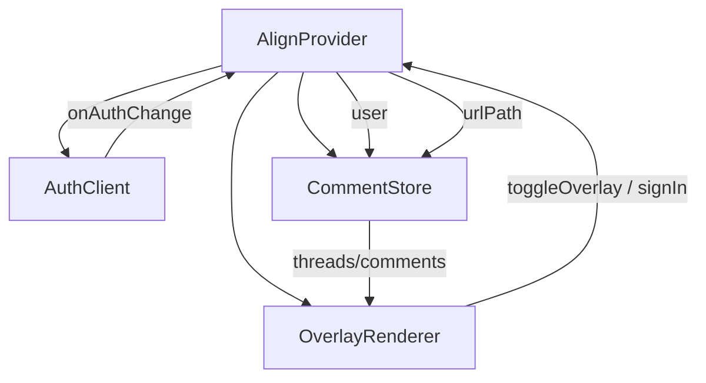

# AlignProvider

> Public entry point of the Align library. Boots the runtime, wires the React context, mounts the overlay portal, and exposes the `useAlign()` hook.

Parent: [Architecture Design](../../DESIGN_DOC.md) · Sibling modules: [`src/auth/`](../auth/README.md), [`src/store/`](../store/README.md), [`src/overlay/`](../overlay/README.md)

## 1. Purpose

`AlignProvider` is the **only component a host app imports**. Wrapping the host tree in `<AlignProvider>` is the entirety of the integration surface and is the cornerstone of the "5-minute setup" goal. Internally it owns runtime state (current user, project id, current `url_path`,overlay visibility), composes the three domain modules (`AuthClient`, `CommentStore`, `OverlayRenderer`), and renders the overlay through a single React portal mounted to `document.body`. When unmounted or when the overlay is toggled off, Align leaves zero DOM, CSS, or layout footprint on the host app.

## 2. Public API

### Component

```tsx
<AlignProvider
  projectId={string}            // required — uuid of the Align project
  supabaseUrl={string}          // required — host project's Supabase URL
  supabaseAnonKey={string}      // required — anon key with RLS enforced
>
  {children}                    // host app tree
</AlignProvider>
```

| Prop | Type | Required | Description |
|------|------|----------|-------------|
| `projectId` | `string` | yes | Project UUID. Used to scope all queries and Realtime subscriptions. |
| `supabaseUrl` | `string` | yes | Host project's Supabase URL. Passed to the bundled `@supabase/supabase-js` client. |
| `supabaseAnonKey` | `string` | yes | Anon key. Permissions are enforced server-side via RLS. |
| `children` | `ReactNode` | yes | The host application tree. Rendered untouched. |

### Hook

```ts
const {
  user,            // CurrentUser | null         — null when signed out
  signIn,          // (email: string) => Promise<void>
  signOut,         // () => Promise<void>
  toggleOverlay,   // () => void                 — flips isVisible
  isVisible,       // boolean                    — overlay on/off
} = useAlign();
```

`useAlign()` throws if called outside an `AlignProvider`. It is the **only** programmatic entry into Align — for custom toggle buttons, custom sign-in flows, or analytics integrations.

### Output / behavioural contract

| Surface | Contract |
|---------|----------|
| DOM | When `isVisible === false` (or unmounted), no Align DOM exists. When `true`, exactly one `<div id="align-root">` is appended to `document.body`. |
| CSS | All styles scoped under `[data-align-root]`. No global selectors, no host-style mutation. |
| Events | Align attaches *passive* listeners to `window` (`popstate`, `pushState`/`replaceState` patches, `resize`). All are removed on unmount. |
| Network | No request is issued before the consumer has called `signIn` or a session has been restored. |
| SSR | The component is safe to render on the server: it returns `<>{children}</>` and no portal/listener side-effects run until `useEffect` fires on the client. |

## 3. Context Shape

The provider exposes a single internal context, `AlignContext`, consumed only by `useAlign()` and by `OverlayRenderer` (sibling tree under the portal).

```ts
type AlignContextValue = {
  // configuration (immutable for the lifetime of the provider)
  projectId: string;

  // identity
  user: CurrentUser | null;
  signIn: (email: string) => Promise<void>;
  signOut: () => Promise<void>;

  // visibility
  isVisible: boolean;
  toggleOverlay: () => void;
  setVisible: (v: boolean) => void;        // internal; not re-exported by useAlign

  // routing
  urlPath: string;                          // current page path; updates on history change

  // module handles (internal)
  auth: AuthClient;
  store: CommentStore;
};
```

Only the public fields (`user`, `signIn`, `signOut`, `isVisible`, `toggleOverlay`) are surfaced through `useAlign()`. The remaining fields are consumed by `OverlayRenderer` directly via the same context.

## 4. Lifecycle

### Mount (client only)

```
1.  Construct stable Supabase client       — useMemo([supabaseUrl, supabaseAnonKey])
2.  Construct AuthClient                   — useMemo([client])
3.  Construct CommentStore                 — useMemo([client, projectId])
4.  useEffect(() => {
      const unsub = auth.onAuthChange(setUser);
      void auth.restoreSession();          // reads localStorage
      return unsub;
    }, [auth]);
5.  useEffect(() => {                      // route detection — see §6
      const unsub = subscribeToRouteChanges(setUrlPath);
      return unsub;
    }, []);
6.  useEffect(() => {                      // page-scoped fetch
      store.setUrlPath(urlPath);
    }, [store, urlPath]);
7.  useEffect(() => {                      // portal element
      const el = document.createElement('div');
      el.id = 'align-root';
      el.setAttribute('data-align-root', '');
      document.body.appendChild(el);
      setPortalEl(el);
      return () => { document.body.removeChild(el); };
    }, []);
```

### Render

```tsx
return (
  <AlignContext.Provider value={ctxValue}>
    {children}
    {portalEl && isVisible
      ? createPortal(<OverlayRenderer />, portalEl)
      : null}
  </AlignContext.Provider>
);
```

`children` is rendered first and unconditionally — Align never gates the host tree on its own readiness.

### Unmount

All `useEffect` cleanups run in reverse order:
- portal `<div>` removed from `document.body`
- route-change listeners detached
- `CommentStore` disposes its Realtime channel and IndexedDB handles
- `AuthClient` unsubscribes from Supabase auth events

Net DOM/CSS/listener delta after unmount is **zero**.

## 5. Portal Creation

| Decision | Choice | Rationale |
|----------|--------|-----------|
| Mount target | `document.body` (new `<div id="align-root">`) | Keeps the overlay outside the host React tree so it cannot inherit host CSS, transforms, `overflow: hidden`, or stacking contexts. |
| Created when | First client-side `useEffect` after mount | Avoids touching `document` during render — required for SSR. |
| Created how | `document.createElement` + `appendChild` | Idempotent; the element is owned by Align and removed on unmount. |
| Visibility | Conditional render via `isVisible` | When toggled off, the portal subtree returns `null`, guaranteeing zero DOM presence per the architecture's "zero host impact" principle. |
| Z-index / pointer-events | Set by `OverlayRenderer`, not the provider | Provider only owns the *container*; the renderer owns the *layer behaviour*. |

## 6. Route-Change Detection

`CommentStore` is page-scoped: every navigation must update `urlPath` so the store re-fetches the right thread set. We do not depend on any router (React Router, Next.js router, TanStack Router) because Align must work in *any* React 18+ app.

### Strategy

A single utility, `subscribeToRouteChanges(setUrlPath)`, wires three signals:

1. **`popstate`** — fires on browser back/forward. Native, well-supported.
2. **Patched `history.pushState` / `history.replaceState`** — the History API does not emit events on programmatic navigation. We monkey-patch *once* per `window`, dispatching a synthetic `align:locationchange` `CustomEvent`. The patch is reference-counted so multiple Align instances on the same page (rare, but possible during HMR) share one patch and the original is restored only when the count returns to zero.
3. **`hashchange`** — for hash-based routing.

```ts
// pseudo-code
function subscribeToRouteChanges(onChange: (path: string) => void) {
installHistoryPatch();                        // ref-counted
  const handler = () => onChange(window.location.pathname + window.location.search);
  window.addEventListener('popstate',            handler);
  window.addEventListener('hashchange',          handler);
  window.addEventListener('align:locationchange', handler);
  onChange(window.location.pathname + window.location.search); // initial
  return () => {
    window.removeEventListener('popstate',            handler);
    window.removeEventListener('hashchange',          handler);
    window.removeEventListener('align:locationchange', handler);
    uninstallHistoryPatch();
  };
}
```

`urlPath` is computed as `pathname + search` (no hash, no origin). This matches the column type chosen in the schema (`threads.url_path`) and the page-scoping query in §8 of the architecture doc.

## 7. Composition: AuthClient + CommentStore + OverlayRenderer



- **AuthClient** is constructed first; the provider observes `onAuthChange` and stores `user` in React state. The user object is forwarded to `CommentStore` (so optimistic mutations carry `author_id`) and exposed via context to `OverlayRenderer` (for avatar rendering and `auth.uid()`-gated UI).
- **CommentStore** receives `(supabaseClient, projectId)` at construction; the provider drives it with `setUrlPath(urlPath)` on every route change. The store internally manages its Realtime channel and IndexedDB cache; the provider treats it as opaque.
- **OverlayRenderer** is rendered through the portal only when `isVisible === true`. It reads everything it needs (`user`, `urlPath`, `store`, `signIn`, `toggleOverlay`) from `AlignContext`. It never imports `AlignProvider`, preserving the unidirectional dependency rule from the architecture doc (§2).

The provider itself contains **no UI logic** beyond the portal mount — every visual concern lives in `OverlayRenderer`.

## 8. SSR Safety

The library targets Next.js (and any other SSR-capable React framework), so the provider must not touch `window`, `document`, `localStorage`, or `history` during render.

| Guarantee | Implementation |
|-----------|----------------|
| No DOM access during render | Portal element creation, history patching, and listener wiring all live inside `useEffect`, which only runs on the client. |
| No Supabase request during render | `AuthClient.restoreSession()` is called from `useEffect`, never inline. |
| No `localStorage` access during render | Supabase client construction is deferred to `useMemo` and only *touches* storage when its methods are called from `useEffect`. |
| No hydration mismatch | The render output is `<AlignContext.Provider>{children}</AlignContext.Provider>` plus a conditional portal that is `null` on the server *and* on the first client render (because `portalEl` state starts `null`). The portal is mounted on the second render, after `useEffect`. |
| `typeof window` guards | A small helper `isBrowser()` wraps any code path that might be reached outside React (e.g. defensive checks in `subscribeToRouteChanges`). |

The hook `useAlign()` itself is SSR-safe: the context is created with sensible defaults (no-op `signIn`/`signOut`, `isVisible: false`, `user: null`, `urlPath: '/'`), so calling it during server render returns valid (inert) values rather than throwing.

## 9. File Organisation

```
src/provider/
├── README.md              ← this document
├── index.ts               ← re-exports AlignProvider, useAlign
├── AlignProvider.tsx      ← component, lifecycle, composition
├── AlignContext.ts        ← context + default value + useAlign hook
├── useRouteChange.ts      ← subscribeToRouteChanges + history patch
└── ssr.ts                 ← isBrowser, safe globals
```

## 10. Design Decisions

| Decision | Rationale |
|----------|-----------|
| Single portal owned by the provider | Matches architecture §6 "single React portal", keeps z-index/pointer-events strategy in one place, and makes unmount trivially clean. |
| Conditional portal render (vs. CSS hide) | Guarantees the architecture's "zero layout shift" NFR — when off, *nothing* exists. CSS-based hiding would still leave the portal `<div>` in the body. |
| Router-agnostic route detection | Align has to work in any React 18+ app per the requirements. A `popstate` + `history` patch + `hashchange` triple covers all client routers without a peer dependency. |
| History API patched once, ref-counted | Multiple provider instances (or hot-reloads) must not double-patch; un-patching is needed for clean teardown. |
| `useAlign` returns a narrow surface | The full context exposes internal handles (`auth`, `store`, `setVisible`); the public hook is intentionally minimal so we can refactor internals without breaking consumers. |
| SSR returns inert defaults rather than throwing | Lets host apps render `useAlign()`-consuming components from a server component shell without conditional rendering boilerplate. |

## 11. Known Limitations

- **History patch is global** — if a host app already wraps `history.pushState`, our patch composes correctly but a future un-installer can only run if every patch un-installs in LIFO order. Practical impact is negligible but documented for completeness.
- **`url_path` granularity** — we use `pathname + search` only. Apps that meaningfully route by hash (`#/route`) will see all hash variants merged unless they switch to history-based routing. A `useAlignRoute(path)` escape hatch is listed as future work in the architecture doc (§11).
- **Single-project scope** — one provider serves one `projectId`. Mounting two providers with different project ids on the same page is undefined behaviour for v1.
- **No prop reconciliation for `projectId` changes** — changing `projectId` mid-session triggers a full remount via `key` is the recommended pattern; live mutation is not supported.

## 12. Related

- Architecture doc §2 (Module Decomposition), §6 (Z-Index & Pointer-Events), §8 (Sub-200ms Load) — drive the contracts above.
- [`src/auth/README.md`](../auth/README.md) — `AuthClient` interface consumed by the provider.
- [`src/store/README.md`](../store/README.md) — `CommentStore` interface; provider drives its `urlPath`.
- [`src/overlay/README.md`](../overlay/README.md) — rendered through the provider's portal.
