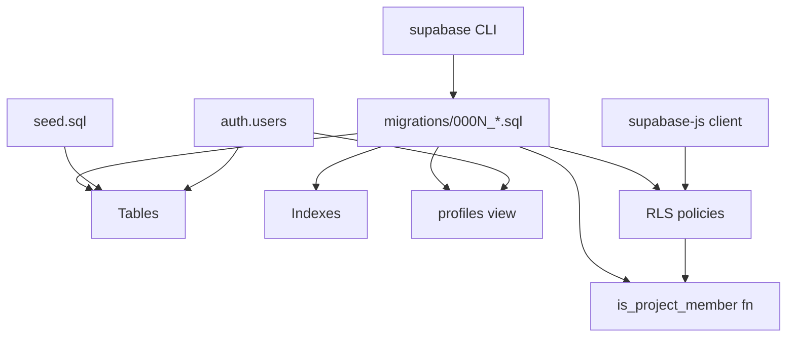

# SupabaseSchema — Module Design

> SQL migrations, table definitions, indexes, views, and Row-Level Security policies for the Align backend. This module is **not bundled** with the npm package; it is shipped as source under `supabase/` and applied by consumers to their own Supabase project.

Parent: [Align — Architecture Design](../DESIGN_DOC.md) · Sibling modules: [`src/provider/`](../src/provider/README.md), [`src/auth/`](../src/auth/README.md), [`src/store/`](../src/store/README.md), [`src/overlay/`](../src/overlay/README.md)

## 1. Purpose

`SupabaseSchema` is the source of truth for Align's persistent state. It owns every Postgres object Align relies on — `projects`, `project_members`, `threads`, `comments`, the `profiles` view, indexes that make the page-scoped query fast, and the Row-Level Security (RLS) policies that enforce membership server-side. The module is consumed by `AuthClient` and `CommentStore` indirectly via `@supabase/supabase-js` (against the host's Supabase project) and is the foundation of the architecture's "BaaS backend, no custom server" decision.

This module is intentionally separate from the React library: it ships as plain SQL so that consumers can audit, apply, and evolve it with standard Supabase tooling (`supabase db push`) without depending on Align's runtime code.

## 2. Internal Structure

**Pattern:** Forward-only migration set, one file per concern, idempotent within each file. A small set of helper SQL functions centralizes membership checks so every RLS policy has the same semantics.



A diagram of the module's structure is rendered in chat (`visId: module-arch-supabase`).

## 3. Public Interface

This module exposes a **SQL surface**, not a JS/TS surface. Its consumers are:

| Consumer | Touches | Notes |
|----------|---------|-------|
| `AuthClient` | `auth.users`, `profiles` view | Reads current user; writes nothing directly (Supabase Auth manages `auth.users`). |
| `CommentStore` | `threads`, `comments`, `project_members`, `profiles` | All reads/writes go through PostgREST + Realtime; RLS gates everything. |
| Project admin | `projects`, `project_members` | Manual rows for v1 (no UI yet). |
| Supabase Realtime | `threads`, `comments` | Channel filtered by `project_id`. |

### Tables, indexes, view

| Object | Kind | Purpose |
|--------|------|---------|
| `projects` | table | One row per Align project (prototype/site). |
| `project_members` | table | Membership: which `auth.users` belong to which project, with role. |
| `threads` | table | Top-level comment thread; carries the DOM-anchor `pin` jsonb and `url_path`. |
| `comments` | table | Individual messages within a thread; `mentions[]` references `auth.users.id`. |
| `profiles` | view | `id, email, display_name, avatar_url` extracted from `auth.users` for safe client read. |
| `is_project_member(project_id)` | function | `SECURITY DEFINER` helper used by every RLS policy. |
| `threads_project_path_idx` | index | `(project_id, url_path) WHERE resolved = false` — drives the sub-200ms page query. |
| `comments_thread_idx` | index | `(thread_id, created_at)` — orders messages within a thread. |

### Realtime channels

| Channel | Filter | Subscribers |
|---------|--------|-------------|
| `threads:project_id=eq.{id}` | server-side `project_id` filter | `CommentStore` (one per active project) |
| `comments:project_id=eq.{id}` | joined-filter via Realtime publication | `CommentStore` |

Both channels rely on the standard Supabase `supabase_realtime` publication; migrations add the relevant tables to it.

## 4. Output Contract

| Surface | Guarantee |
|---------|-----------|
| RLS coverage | Every Align-owned table has RLS `ENABLED` and at least one policy per CRUD verb. No table is reachable via the anon key without a matching policy. |
| Member-gated reads | A user can only `SELECT` threads/comments belonging to a project they are a member of (`is_project_member(threads.project_id)`). |
| Self-only writes | `comments.author_id` and `threads.created_by` must equal `auth.uid()` on `INSERT`. `comments.body` is mutable only by its author. |
| Cascade deletes | Deleting a `project` cascades to `project_members`, `threads`, `comments`. Deleting a `thread` cascades to its `comments`. |
| Page-scoped query | `select * from threads where project_id = $1 and url_path = $2 and resolved = false` is index-only on `threads_project_path_idx`. |
| Realtime delivery | `INSERT`/`UPDATE`/`DELETE` on `threads` and `comments` are published to subscribed clients within seconds. |
| Forward-only | Migrations are append-only. No file is ever rewritten; corrections ship as a new numbered migration. |

## 5. Internal File Organization

```
supabase/
├── README.md                            ← this document
├── config.toml                          ← supabase CLI project config
├── seed.sql                             ← dev fixtures (one project, two members, sample threads)
└── migrations/
    └── 0001_align_init.sql              ← v1 baseline: tables, view, helper, RLS policies,
                                          indexes, realtime publication (single file)
```

`0001_align_init.sql` is the **v1 baseline** applied as one file by fresh consumers — internally it's organised in sections (tables → view + helper → RLS policies → indexes → realtime). Treat it as frozen post-release: any post-v1 schema change ships as a new numbered file (`0002_*.sql`, `0003_*.sql`, …) so existing consumers can migrate forward incrementally.

## 6. Tables (canonical definitions)

These mirror [DESIGN_DOC §3](../DESIGN_DOC.md#3-data-model) and are the single source of truth.

```sql
create table projects (
  id          uuid primary key default gen_random_uuid(),
  name        text not null,
  created_at  timestamptz not null default now()
);
alter table projects enable row level security;

create type project_role as enum ('member', 'admin');

create table project_members (
  project_id  uuid not null references projects(id) on delete cascade,
  user_id     uuid not null references auth.users(id) on delete cascade,
  role        project_role not null default 'member',
  created_at  timestamptz not null default now(),
  primary key (project_id, user_id)
);
alter table project_members enable row level security;

create table threads (
  id           uuid primary key default gen_random_uuid(),
  project_id   uuid not null references projects(id) on delete cascade,
  url_path     text not null,
  pin          jsonb not null,
  state_key    text not null default '',
  resolved     boolean not null default false,
  resolved_by  uuid references auth.users(id),
  resolved_at  timestamptz,
  created_by   uuid not null references auth.users(id),
  created_at   timestamptz not null default now()
);
alter table threads enable row level security;

create table comments (
  id          uuid primary key default gen_random_uuid(),
  thread_id   uuid not null references threads(id) on delete cascade,
  author_id   uuid not null references auth.users(id),
  body        text not null,
  mentions    uuid[] not null default '{}',
  created_at  timestamptz not null default now(),
  edited_at   timestamptz
);
alter table comments enable row level security;
```

## 7. The `profiles` View

```sql
create or replace view profiles as
select
  u.id,
  u.email,
  coalesce(u.raw_user_meta_data ->> 'display_name', split_part(u.email, '@', 1)) as display_name,
  u.raw_user_meta_data ->> 'avatar_url' as avatar_url
from auth.users u;

grant select on profiles to authenticated;
```

The view never exposes `auth.users` columns the client shouldn't see (encrypted password, confirmation tokens). Access is gated to `authenticated` so the anon role cannot enumerate users.

## 8. Membership Helper Function

```sql
create or replace function is_project_member(_project_id uuid)
returns boolean
language sql
security definer
set search_path = public
stable
as $$
  select exists (
    select 1
    from project_members
    where project_id = _project_id
      and user_id    = auth.uid()
  );
$$;

revoke all on function is_project_member(uuid) from public;
grant execute on function is_project_member(uuid) to authenticated;
```

Every RLS policy delegates to this helper. Centralising the check has three concrete benefits:

1. **One place to audit.** Auditors review one function rather than N policies for membership semantics.
2. **Consistent semantics.** A future change (e.g. soft-deleted memberships) updates one site.
3. **Cheaper plans.** Postgres caches the function result within a query; per-policy inline `EXISTS` would re-plan.

`SECURITY DEFINER` is required because the function reads `project_members`, which itself has RLS — without it, recursion through RLS would block the check.

## 9. RLS Policies

```sql
-- projects ----------------------------------------------------------
create policy projects_select_member on projects
  for select using (is_project_member(id));

-- (insert/update/delete on projects: admin-only flow, deferred to v1.1)

-- project_members ---------------------------------------------------
create policy members_select_member on project_members
  for select using (is_project_member(project_id));

-- (insert/update/delete: admin flow, deferred)

-- threads -----------------------------------------------------------
create policy threads_select_member on threads
  for select using (is_project_member(project_id));

create policy threads_insert_member on threads
  for insert with check (
    is_project_member(project_id) and created_by = auth.uid()
  );

create policy threads_update_resolve on threads
  for update using (is_project_member(project_id))
  with check    (is_project_member(project_id));
-- column-level note: client only ever updates `resolved`/`resolved_by`/`resolved_at`.

create policy threads_delete_author on threads
  for delete using (is_project_member(project_id) and created_by = auth.uid());

-- comments ----------------------------------------------------------
create policy comments_select_member on comments
  for select using (
    exists (
      select 1 from threads t
      where t.id = comments.thread_id
        and is_project_member(t.project_id)
    )
  );

create policy comments_insert_member on comments
  for insert with check (
    author_id = auth.uid()
    and exists (
      select 1 from threads t
      where t.id = comments.thread_id
        and is_project_member(t.project_id)
    )
  );

create policy comments_update_author on comments
  for update using (author_id = auth.uid())
  with check    (author_id = auth.uid());

create policy comments_delete_author on comments
  for delete using (author_id = auth.uid());
```

Behavioural summary, mirrored against [DESIGN_DOC §3](../DESIGN_DOC.md#3-data-model):
- Members of a project may read all threads and comments in it.
- Only members may create threads/comments, and `created_by` / `author_id` is forced to the caller.
- Any member may resolve/unresolve a thread; only the original author may edit or delete a comment.
- Non-members see nothing — the anon key alone yields zero rows.

## 10. Indexes

```sql
create index threads_project_path_idx
  on threads (project_id, url_path)
  where resolved = false;

create index comments_thread_idx
  on comments (thread_id, created_at);
```

The partial index on unresolved threads matches the **default page-scoped query** ([DESIGN_DOC §8](../DESIGN_DOC.md#8-sub-200ms-comment-load-strategy)) and keeps the working set tiny on long-lived projects. `comments_thread_idx` makes thread popovers' message ordering O(log n).

## 11. Realtime Publication

```sql
alter publication supabase_realtime add table threads;
alter publication supabase_realtime add table comments;
```

`CommentStore` subscribes per-project; the server-side filter (`project_id=eq.{id}`) keeps wire traffic to a single project. RLS still applies on read of the resulting payloads, so listeners can never receive events for projects they don't belong to.

## 12. Apply Strategy

The Supabase CLI is the canonical apply path for both consumers and CI:

```bash
# Once per consumer project:
supabase link --project-ref <ref>

# Apply (or update) all migrations in order:
supabase db push

# Reset + reapply + load seed data (local/dev only):
supabase db reset
```

`supabase db push` is idempotent: it tracks applied migrations in `supabase_migrations.schema_migrations` and only runs new ones. CI runs the same command against an ephemeral project to validate that migrations apply cleanly from zero.

## 13. Seed Data

```
supabase/seed.sql
```

The seed script populates the local dev database after `supabase db reset` with:
- 1 sample project (`Acme Demo`)
- 2 members (using local Supabase Auth test users)
- 3 sample threads on different `url_path` values, each with 1–3 comments

Seed data exists **for local development and demos only** — it is never applied to production projects (the CLI's `db push` does not run `seed.sql`; only `db reset` does).

## 14. Design Decisions

| Decision | Rationale |
|----------|-----------|
| **One migration per concern** (vs. single bootstrap) | Smaller diffs to review, easier to revert by adding a corrective migration, and matches the Supabase community norm. |
| **Helper function `is_project_member`** | Centralises membership semantics across many policies; one auditable site; consistent query plans. `SECURITY DEFINER` avoids RLS recursion through `project_members`. |
| **Forward-only migrations** | Down migrations are notoriously brittle and rarely used in production. v1 trades the unused safety net for simpler tooling; corrective migrations remain available. |
| **`profiles` view, not a synced table** | Avoids drift and a trigger maintenance burden. The view is a read-only projection of `auth.users` exposing only safe columns. |
| **Partial index on unresolved threads** | The default page query filters `resolved = false`; a partial index keeps it small and warm even after years of resolved threads accumulate. |
| **Server-side Realtime filter `project_id=eq.{id}`** | Cuts wire traffic for clients on multi-project Supabase instances; combined with RLS it is also a defence-in-depth boundary. |
| **Schema lives outside the npm package** | Consumers must own and version their own database. Bundling SQL inside the JS package would conflate library versioning with database schema versioning and complicate audits. |
| **Supabase CLI is the canonical apply path** | Matches Supabase's standard tooling and keeps CI parity trivial. Manual paste in the dashboard remains possible but undocumented. |
| **Seed script included** | Speeds up local development and demo recordings; isolated to `db reset` so it cannot pollute production. |

## 15. Known Limitations

- **No public/anonymous read mode in v1** — every read requires `auth.uid()` to satisfy `is_project_member`. Per [DESIGN_DOC §11](../DESIGN_DOC.md#11-open-questions--future-work), a future `projects.public_read` flag with a corresponding `or projects.public_read` clause in the SELECT policies would lift this for read-only viewers.
- **Admin/membership management has no UI** — `project_members` rows are inserted manually (SQL editor) for v1. The invite-link flow noted in [DESIGN_DOC §4](../DESIGN_DOC.md#4-auth-flow-supabase-magic-link) is a stretch goal.
- **Forward-only migrations** — rolling back a deployed migration requires authoring a new corrective migration; there is no `supabase db rollback` path.
- **Postgres/Supabase-specific** — the schema, RLS syntax, and `auth.users` join all assume Supabase. Self-hosted backends would need a separate adapter module ([DESIGN_DOC §11](../DESIGN_DOC.md#11-open-questions--future-work)).
- **No column-level RLS on `threads` updates** — the `threads_update_resolve` policy permits any column update by any member; the client is trusted to only mutate `resolved`/`resolved_by`/`resolved_at`. Tightening this to column-level grants is a v1.1 hardening item.

## 16. Sub-Modules to Document Next

- `migrations/` could warrant its own [submodule-design](.bonsai/registry.json) doc once the migration set grows past v1 (e.g. when `public_read`, invite-links, or column-level RLS land).

## 17. Links

- **Parent:** [Align — Architecture Design](../DESIGN_DOC.md)
- **Sibling modules:** [`src/provider/README.md`](../src/provider/README.md), [`src/auth/README.md`](../src/auth/README.md), [`src/store/README.md`](../src/store/README.md), [`src/overlay/README.md`](../src/overlay/README.md)
- **References:** DESIGN_DOC §3 (Data Model), §4 (Auth Flow), §8 (Sub-200ms Strategy), §11 (Open Questions)
